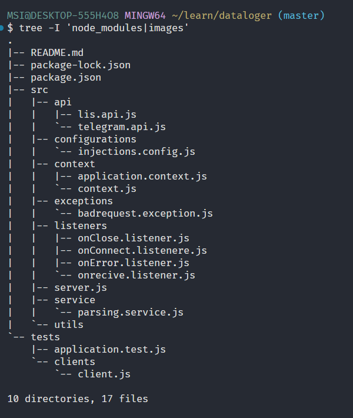

# DATALOGER ARCHITECTURE
Berikut ini merupakan boleerplate atau project structure untuk mengembangkan applikasi datalogger, pada project structure ini menganut konsep **CLEAN ARCHITECTURE** yang mana kode yang akan ditulis akan diletakan sesuai dengan kategori logic kode tersebut. ada beberapa folder pada boilerplate atau project structure ini, diantaranya yaitu: 
- src
- api
- clients
- configurations
- context
- listeners
- services
- utils
- tests

  
tidak perlu kawatir atau bingung mengenai folder tersebut, pada dasarnya folder-folder tersebut hanya digunakan untuk mengelompokan jenis-jenis kode atau logic dari applikasi yang akan kita buat agar mudah di maintanance, flexibele, mudah di debug, dan easy to understand.  
## src
**src** atau kepanjangan dari *source* adalah folder yang akan menampung semua kode yang akan kita tulis mulai dari logic bisnis dan sebagainya, kecuali kode yang berkaitan dengan unit test
## api
**api** merupakan kepanjangan dari **Application Programming Interface** pada folder ini akan berisi kode-kode yang berkaitan dengan thirdparty API(melakukan HTTP REQUEST)
## configurations
Pada folder **configurations** ini akan memuat semua kode-kode yang berkaitan dengan konfigurasi alur hidup dari applikasi, misalnya seperti konfigurasi *Dependency Injection*
## context

## lsteners
## services
## utils
## tests
## clients

created by alli
https://github.com/alliano